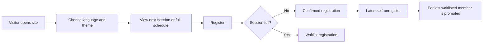

<div align="center">
  <h1>NTNUI Bordtennis</h1>
  <p>Multilingual training registration site for NTNUI Bordtennis at Dragvoll Idrettssenter B217.</p>
  <p>
    <a href="https://nextjs.org/"></a>
    <a href="https://react.dev/"></a>
    <a href="https://www.typescriptlang.org/"></a>
    <a href="https://www.postgresql.org/"></a>
    <a href="https://developers.cloudflare.com/turnstile/"></a>
    <a href="https://www.heroku.com/"></a>
  </p>
  <p>
    <a href="#overview">Overview</a> |
    <a href="#features">Features</a> |
    <a href="#languages">Languages</a> |
    <a href="#routes">Routes</a> |
    <a href="#local-setup">Local setup</a> |
    <a href="#deployment">Deployment</a>
  </p>
</div>

## Overview

This project is a practical club website for NTNUI Bordtennis. It is designed around fast registration and self-service unregistration without user accounts, while still covering the operational things the club actually needs: live session capacity, waiting list handling, announcements, FAQ information, multilingual public pages, and an admin panel for managing sessions.

The public site uses route-based locales such as `/no`, `/en`, `/de`, and `/zh`, while `/admin` is protected separately with credentials and can also sit behind Heroku auth.

## Features

| Area | What it does |
| --- | --- |
| Homepage | Shows the next or current training session, live signup count, available spots, and public participant list |
| Registration | Lets members sign up without creating accounts |
| Unregistration | Lets members remove themselves using birth month and birth day verification |
| Waiting list | Automatically places extra signups on a waitlist and promotes the earliest waitlisted person when a spot opens |
| Schedule | Lists active and upcoming sessions with live `registered/capacity` counts |
| Announcements | Displays club notices such as cancellations across the public site |
| FAQ | Answers common membership, equipment, and training questions |
| Languages | Supports Norwegian, English, Danish, Swedish, German, Chinese, French, and Spanish |
| Theme | Supports dark and light mode, with dark mode as the default |
| Responsive UI | Uses a premium desktop layout and a compact mobile navigation/menu flow |
| Navigation | Includes direct MazeMap access for Dragvoll Idrettssenter B217 |
| Admin | Manage sessions, announcements, registrations, and club operations from `/admin` |
| Anti-abuse | Uses Cloudflare Turnstile on register and unregister flows |

## Workflow



## Languages

| Locale | Language | Public route |
| --- | --- | --- |
| `no` | Norwegian | `/no` |
| `en` | English | `/en` |
| `da` | Danish | `/da` |
| `sv` | Swedish | `/sv` |
| `de` | German | `/de` |
| `zh` | Chinese | `/zh` |
| `fr` | French | `/fr` |
| `es` | Spanish | `/es` |

Old root-level public routes redirect to the default Norwegian pages.

## Tech stack

- Next.js 16.2
- React 19
- TypeScript
- PostgreSQL
- Cloudflare Turnstile
- Tailwind CSS 4
- Heroku deployment via `Procfile`

## Routes

| Route | Purpose |
| --- | --- |
| `/no` | Homepage with next session, live count, and visible registrations |
| `/no/schedule` | Session overview |
| `/no/register` | Registration form |
| `/no/unregister` | Self-unregistration form |
| `/no/faq` | Frequently asked questions |
| `/no/about` | Club information and contact details |
| `/admin` | Session, announcement, and registration management |

## Local setup

### 1. Install dependencies

```bash
npm install
```

### 2. Create `.env.local`

```env
DATABASE_URL=postgres://...
NEXT_PUBLIC_TURNSTILE_SITE_KEY=your_turnstile_site_key
TURNSTILE_SECRET_KEY=your_turnstile_secret_key
ADMIN_USER=your_admin_username
ADMIN_PASS=your_admin_password
SITE_URL=http://localhost:3000
GOOGLE_SITE_VERIFICATION=
```

### 3. Initialize the database

```bash
node scripts/init-db.js
```

### 4. Start the development server

```bash
npm run dev
```

Open [http://localhost:3000](http://localhost:3000).

## Environment variables

| Variable | Required | Purpose |
| --- | --- | --- |
| `DATABASE_URL` | Yes | PostgreSQL connection string used by the app and DB init script |
| `NEXT_PUBLIC_TURNSTILE_SITE_KEY` | Yes | Public Turnstile site key for the browser widget |
| `TURNSTILE_SECRET_KEY` | Yes | Secret key used to verify Turnstile tokens server-side |
| `ADMIN_USER` | Yes | Username for `/admin` basic auth |
| `ADMIN_PASS` | Yes | Password for `/admin` basic auth |
| `SITE_URL` | Recommended | Canonical site URL used for metadata, sitemap, robots, and structured data |
| `GOOGLE_SITE_VERIFICATION` | Optional | Google Search Console verification token |

## Deployment

### Heroku checklist

1. Set Heroku config vars for `DATABASE_URL`, `NEXT_PUBLIC_TURNSTILE_SITE_KEY`, `TURNSTILE_SECRET_KEY`, `ADMIN_USER`, `ADMIN_PASS`, and `SITE_URL`.
2. Optionally set `GOOGLE_SITE_VERIFICATION`.
3. Deploy the app:

```bash
git push heroku main
```

4. Run the database init/migration step:

```bash
heroku run -a <your-app-name> -- node scripts/init-db.js
```

## Operational notes

- Session capacity counts confirmed registrations only.
- If a session is full, new signups are stored as `waitlist`.
- When a confirmed player unregisters, the earliest waitlisted player is promoted automatically.
- Announcements are written once and shown as-is across languages.
- The venue label is kept as `Dragvoll Idrettssenter B217` across locales for map consistency.
- The public site uses locale-based URLs for better multilingual SEO.

## SEO

The site includes:

- locale-based public URLs
- canonical metadata
- `robots.txt`
- `sitemap.xml`
- Open Graph and Twitter metadata
- homepage JSON-LD structured data

Recommended production setup:

1. Set `SITE_URL` to the real public domain.
2. Set `GOOGLE_SITE_VERIFICATION` after verifying the site in Google Search Console.
3. Submit `/sitemap.xml` in Search Console.

## Project structure

```text
app/
  [locale]/           Localized public pages
  admin/              Admin UI
  api/                Registration, unregistration, sessions, announcements
  components/         Shared UI and public page components
lib/
  faq-content.ts      FAQ translations and content
  registrations.ts    Waiting list and promotion logic
  seo.ts              Metadata and SEO helpers
  site-content.ts     Locales, translations, and shared labels
scripts/
  init-db.js          Database setup and schema migrations
proxy.ts              Locale header injection and admin basic auth
public/
  images/             Website and gallery images
```

## License

Private club project unless you choose to publish it under a separate license.
